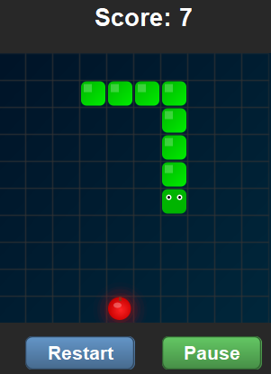

# Snake Game

The classic Snake game implemented in Java with an attractive UI and smooth gameplay.



## How to Play

To play run the application in the Snake folder. Use the W,A,S,D keys to control the snake.

## Controls

- **W** - Move Up
- **A** - Move Left
- **S** - Move Down
- **D** - Move Right
- There are also on-screen controls for pausing and restarting the game

### Running from Source

1. Ensure you have Java installed on your system
2. Compile the source files:
   ```bash
   javac -d out src/*.java
   ```
3. Run the compiled program:
   ```bash
   java -cp out Game
   ```

### Creating Your Own Executable

1. Compile the Java code:
   ```bash
   javac -d out src/*.java
   ```

2. Create a JAR file:
   ```bash
   mkdir -p out/META-INF
   echo "Main-Class: Game" > out/META-INF/MANIFEST.MF
   jar cvfm Snake.jar out/META-INF/MANIFEST.MF -C out .
   ```

3. Use jpackage (requires JDK 14+):
   ```bash
   jpackage --input . --name Snake --main-jar Snake.jar --main-class Game --type exe --icon src/Snake.ico --win-console --dest dist
   ```

## Requirements

- Windows OS for the executable version
- Java Runtime Environment (JRE) 8 or higher for running from source
